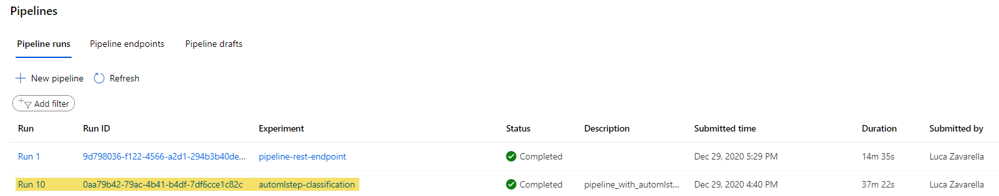

<!-- #region -->
# Operationalize Machine Learning

The project consists of two subprojects:

1) Deploying a model trained by an Azure AutoML experiment in order to deploy it and consume its endpoint

2) Creating, publishing and consuming an Azure Machine Learning Pipeline

The first subproject aims to test the AuotML on the Bank Marketing dataset. The best trained model is published on a web service and therefore can be tested by any client through REST api calls.

The second subproject aims to automate the training of the model using AuotML, assuming that the results obtained from the previous subproject are satisfactory. Automation is achieved by creating, publishing and using an ML Pipeline.

In the following paragraphs I will detail all the steps that were necessary to arrive at the final result.

## Architectural Diagram

A better overview of the phases of the two subprojects is given by the following architectural diagram:

## How to Improve the Project

There are few possible improvements that can boost model performance:

* Better data transformation / engineering
    * Variable "duration" is not known before a call is performed. Also, after the end of the call y is obviously known. So this variable should be removed to avoid data leaks
    * Variable "pdays" is the number of days that passed by after the client was last contacted from a previous campaign. As 999 means client was not previously contacted, a dummy variable "contacted_before" (0 if 999, 1 otherwise) could improve the model performance.
    * Numeric variables having a non-negligible number of unique values (like "duration", "cons.price.idx", etc.) should be binned
* Stratified strategies to be adopted as the target variable is imbalanced
    * Using the cv_split_column_names parameter in the AutoMLConfig settings in order to use calculated columns as placeholders for a custom stratified cross-validation
* Using a primary metric that takes into account the unbalance of the classes (e.g. AUC weighted)
    * Otherwise an oversampling technique like SMOTE could be used to balance the classes distribution

The upon mentioned data transformations can be applied to the dataset using an additional *PythonScriptStep* to the pipeline, just before the *AutoMLStep*.

## Key Steps

### Authentication

The authentication mode required by the project is via **Service Principal**.

In terms of accessing the resources made available by Azure Machine Learning, authentication via Service Principal is often used when there is a need to automate a workflow using external processes that need to interact with Azure ML. For example, a Service Principal is critical to be able to use Azure ML artifacts from Azure CI/CD Devops Pipelines.

This authentication mode will not be used in the following part of the project. However, it remains the primary mode in more complex automation scenarios.

Next, I share a series of snapshots that summarize the operations performed to properly configure a Service Principal trmaite the *az* tool:

1) Creation of the Server Principal *SP*

2) Correct execution of the `az ad sp show` and `az ml workspace share` commands

### Automated ML Experiment

In order to run an AutoML experiment from the UI, you must first load the training CSV dataset into Azure ML Studio as a Dataset. Then the AutoML experiment will search for the best transformation pipeline/model/hyperparameters that give the highest performance for the given dataset. The following screenshots show that the AutoML experiment has completed successfully:

1) Bank Marketing as registered Dataset

2) Bank Marketing CSV correctly loaded as Dataset

3) The AutoML experiment completed with success:

4) The best model found by AutoML is the VotingEnsemble one:

### Get Logging and enable "Application Insights"

After the best model is deployed on Azure Container Instance, here the logs taken after the endpoint deployment and the successful enablement of Application Insights:

1) Show endpoint logs and enable "Application Insights"

2) "Application Insights" is enabled for the endpoint

### Swagger Documentation

Using Swagger, it's easy to document the REST Api related to the scoring endpoint. The following screenshot shows with clarity which are the features of the occurrences to give in input to the endpoint:

1) Show Swagger running on localhost

### Consume Model Endpoints

Once the model is deployed, a third party application can easily call the endpoint getting the scoring results for the provided input occurrences. Here two examples using first a simple Python code and then using *Apache Benchmark* to get a benchmark for the endpoint:

1) Producing JSON output from the API using a Python script

2) Using Apache Benchmark (ab) against the HTTP API:

### Create, Publish and Consume a Pipeline

The following screenshots document all the steps performed to create and publish the pipeline:

1) Pipeline created on Azure ML Studio

2) Published pipeline endpoint on Azure ML Studio

3) Pipeline graph showing the Bank Marketing dataset and the AutoML modules:

4) Published pipeline overview:

5) The Jupyter Notebook cell showing the RunDetails Widget:

6) The scheduled run on Azure ML Studio:

## Screen Recording

Here the screencast link showing the entire process of the working ML application:

https://youtu.be/xwfJLoLytS4

## Standout Suggestions

During the course of the project, I spotted two bugs that I immediately reported to the mentors:

1) The *serve.py* script doesn't convert the passed port as integer ([reported here](https://knowledge.udacity.com/questions/427478))

2) The Bank Marketing train dataset is wrongly used as test dataset ([reported here](https://knowledge.udacity.com/questions/427871))
<!-- #endregion -->
